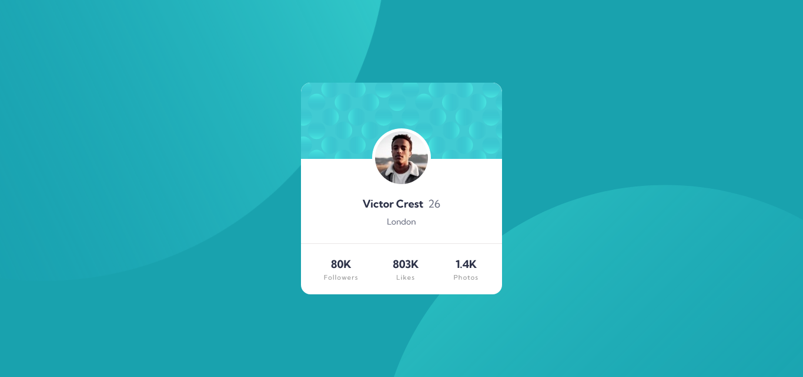
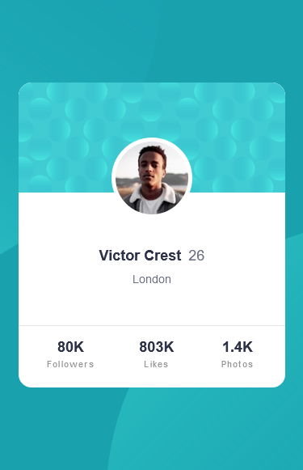

# Frontend Mentor - Profile card component solution

This is a solution to the [Profile card component challenge on Frontend Mentor](https://www.frontendmentor.io/challenges/profile-card-component-cfArpWshJ). Frontend Mentor challenges help you improve your coding skills by building realistic projects.

## Table of contents

- [Overview](#overview)
  - [The challenge](#the-challenge)
  - [Screenshot](#screenshot)
  - [Links](#links)
- [My process](#my-process)
  - [Built with](#built-with)
  - [What I learned](#what-i-learned)
  - [Continued development](#continued-development)
  - [Useful resources](#useful-resources)
- [Author](#author)
- [Acknowledgments](#acknowledgments)

## Overview

### The challenge

- Build out the project to the designs provided

### Screenshot

Below is the screenshots of the challenge, the desktop view is 1440px and the mobile view was queried at 375px.s

### Links

- Solution URL: (https://github.com/Odo-Peter/frontend-mentor-profile-card)
- Live Site URL: (https://frontend-mentor-profile-card-tau.vercel.app)

## My process

### Built with

- Semantic HTML5 markup
- CSS custom properties
- Flexbox

### What I learned

This challenge has taught me the importance of a proper markup and the power of CSS, alongside media queries, also, in the cause of the challenge, learning to work with an API again, feels awesome (by API, I meant importing the google fonts from google api and using it in the challenge).

The challenge has also added to my knowledge, in terms of using markdown files and in committing a file to github, basically working with the command line has improved some more, all thanks to frontend mentor's challenge.

Futhermore, I learnt how to set svgs' as background image for the body of the markup and transforming, translating, and rotating it to the desired style.

### Continued development

In future projects or challenges, I'ld love to add a javascript function that changes the svgs' at the background and also, change the profile content, maybe like a search function.

### Useful resources

- [Free code camp](https://www.freecodecamp.org) - This site personally has improved my coding skills from 0 to a reasonable figure, lol, I'll recommend any person new to programming and coding to check free code camp for FREE. Ensure to be kind enough to give a little donation to help them to continue giving out value.
- [Tech Twitter](https://www.twitter.com) - Tech twitter has helped with several links to quality resources, articles, podcasts, videos, etc, that has helped to improve my coding skills and thus helping me complete this challenge.

## Author

- Frontend Mentor - [@Odo-Peter](https://www.https://frontendmentor.io/profile/Odo-Peter)
- Twitter - [@Odo_Peter_Ebere](https://www.twitter.com/iCode_X)
- Frontend Mentor - [@Odo-Peter](https://www.frontendmentor.io/profile/Odo-Peter)

## Acknowledgments

I really want to acknowledge myself for a work 'not really well done' for the second time. LOL 🎉
